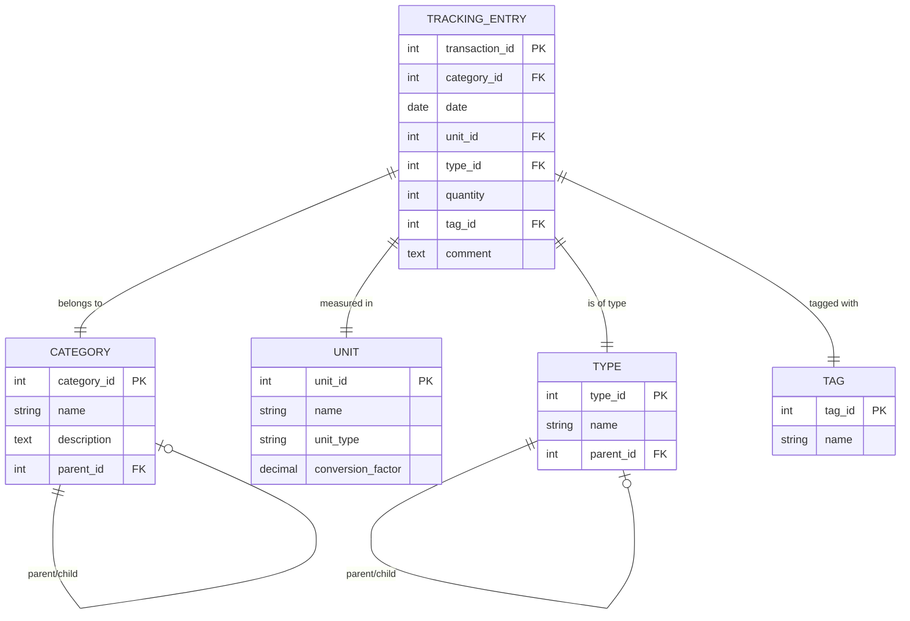

# Database Schema

## Entity Relationship Diagram

## Description

- **TRACKING_ENTRIES**: Main table for all tracking entries
- **CATEGORIES**: Hierarchical categories (e.g. Sports > Running)  
- **UNITS**: Units of measurement with conversion factors
- **TYPES**: Hierarchical types (e.g. Education > Bachelor)
- **TAGS**: Flexible tags for additional categorization